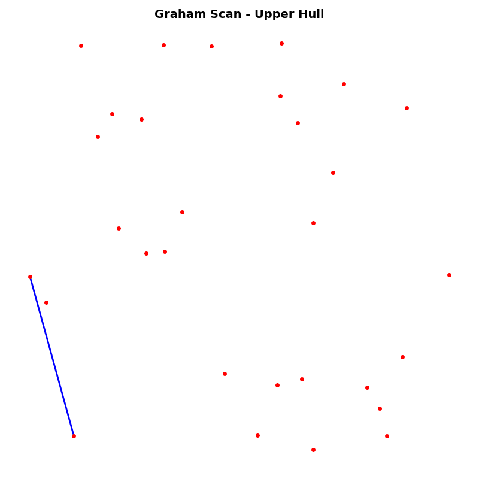
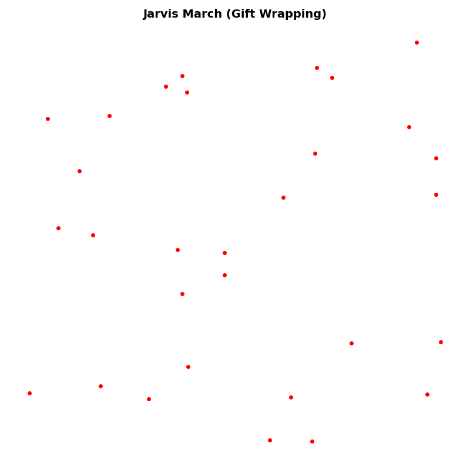

# Convex Hull Algorithms

This project implements two classic algorithms for computing the convex hull of a point set in 2D:

- **Graham Scan** - An efficient algorithm with O(n log n) time complexity
- **Jarvis March (Gift Wrapping)** - A simpler algorithm with O(nh) time complexity, where h is the number of points on the hull

The convex hull of a point set is one of the most studied geometric problems in both algorithmics and pure mathematics. Computing the convex hull is a fundamental operation in computational geometry.

## Features

- ✅ Step-by-step visual representation of the algorithms
- ✅ Both algorithms fully implemented
- ✅ Interactive visualization with matplotlib
- ✅ Clean, well-documented code

## Visualizations

### Graham Scan Algorithm



### Jarvis March Algorithm



## Installation

1. Clone the repository:
```bash
git clone https://github.com/djzh23/convexhull.git
cd convexhull
```

2. Create a virtual environment (recommended):
```bash
python -m venv venv
```

3. Activate the virtual environment:
   - Windows:
   ```bash
   venv\Scripts\activate
   ```
   - Linux/Mac:
   ```bash
   source venv/bin/activate
   ```

4. Install dependencies:
```bash
pip install -r requirements.txt
```

## Usage

### Graham Scan Algorithm

```bash
python FindingConvexHullImplementierung/GrahamScan.py [number_of_points]
```

Example:
```bash
python FindingConvexHullImplementierung/GrahamScan.py 50
```

If no number is provided, you will be prompted to enter it.

### Jarvis March Algorithm

```bash
python FindingConvexHullImplementierung/JarvisMarch.py [number_of_points]
```

Example:
```bash
python FindingConvexHullImplementierung/JarvisMarch.py 50
```

## Algorithms

### Graham Scan

The Graham Scan algorithm works in two phases:
1. **Upper Hull**: Computes the upper part of the convex hull
2. **Lower Hull**: Computes the lower part of the convex hull

**Time Complexity**: O(n log n)  
**Space Complexity**: O(n)

### Jarvis March (Gift Wrapping)

The Jarvis March algorithm starts with the leftmost point and "wraps" the hull step by step until it returns to the starting point.

**Time Complexity**: O(nh), where h is the number of points on the hull  
**Space Complexity**: O(n)

## Project Structure

```
convexhull/
├── FindingConvexHullImplementierung/
│   ├── GrahamScan.py          # Graham Scan implementation
│   └── JarvisMarch.py          # Jarvis March implementation
├── requirements.txt            # Python dependencies
├── .gitignore                  # Git ignore file
├── REFERENCES.md               # References and sources
├── demo_graham_scan.gif        # Graham Scan visualization
├── demo_jarvis_march.gif       # Jarvis March visualization
└── README.md                   # This file
```

## Dependencies

- `numpy >= 1.19.0` - For numerical operations
- `matplotlib >= 3.3.0` - For visualization

## References

The implementations are based on the following sources:
- [Jarvis March Demonstration](https://www.wolframcloud.com/objects/demonstrations/JarvisMarchToFindTheConvexHullOfASetOfPointsIn2D-source.nb)
- [Convex Hull Notes](http://jeffe.cs.illinois.edu/teaching/373/notes/x05-convexhull.pdf)
- [Convex Hull Tutorial](https://learnopencv.com/convex-hull-using-opencv-in-python-and-c/)

## License

This project was created as a university project and is available for educational purposes.

## Author

University project - published on GitHub
